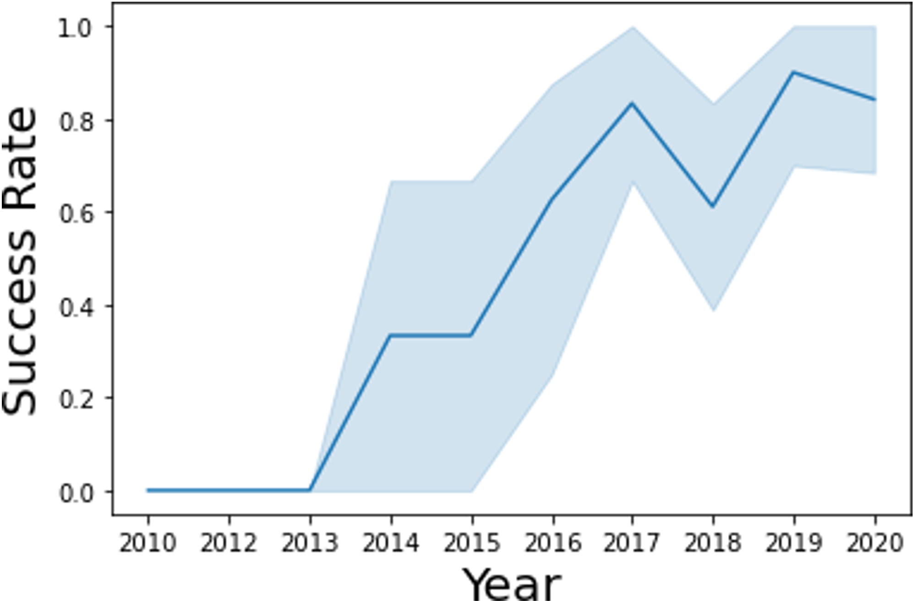

Welcome to my projecct portfolio page! 

Please feel free to share any suggestions you may have regarding my projects. Thank you!🥳

# 🤘My Skills
- **Professional Skills:** Leadership, Team Communication, Presentation, Multi-task Management

- **Marketing:** Marketing Management, Consumer Insights, Digital Marketing, Media Strategy, Global Perspective

- **Analytics:**  A/B Testing, Predictive Analysis (Linear Regression, Logistic Regression, Time Series Forecasting), Clustering, Classification, Conjoint Analysis, Survival Analysis, CLV Analysis, Pricing Analysis, Campaign Analysis

- **Python (1+ years):** Pandas, Numpy, Matplotlib, Seaborn, Plotly, Statsmodels, Sklearn

- **SQL (1+ years):** Advanced Joins, Subqueries, Window Functions, MySQL, Snowflake

- **Others:** Excel (3+ years), Powerpoint (3+ years), R (1+ years), Tableau (1+ years)

 

# 🎮Playstudios Loyalty Program Engagement Model (In Progress)
- Led a team of four to drive project progress, monitor outcomes, and communicate with clients and other parties to coordinate tasks and timelines.

- Developed project methodology collaborating with teammates. Processed 2 million player data independently, including querying and cleaning data and creating model variables, with snowflake, SQL, and Python.

- Segmented players using machine learning models. Built a retention model to identify early characteristics of loyal players based on classification and survival analysis.

- Our team is now designing a marketing campaign to increase player loyalty with highly efficient campaign methods, based on insights from player analysis and models.

- Designed decks and communicated project methodology and outcomes to clients, synthesizing technical analysis into simple and clear terms.

 

# 🏅McCombs Marketing Case Challenge of SAMSUNG
- Won the 3rd place against 21 MSM and MBA teams in the case competition judged by Fortune 500 executives.

- Recommended a blue ocean strategy for SAMSUNG to gain Gen Z customers based on 3 models and qualitative research.

- Led and presented the quantitative analysis of customer segmentation and brand positioning using Tableau and Excel.

### Key Insights
- **Target Segment:** Based on our analysis, within Gen Z Girls, the Gen Z Girl Gamer has the highest potential and alignment with SAMSUNG's product portfolio.

- **Emerging Market:** Almost all Gen Z Girls already have a phone. So, to break into the market, targeting wireless audio is the most ideal because it is an emerging market.

- **Current Positioning:** We noticed a potential new market of wireless audio for gaming with no other major competitors for SAMSUNG Galaxy Buds.

- **Proposed Campaign:** We propose a campaign called #AllYou based on Gen Z’s psychographics. This campaign will build empathy with consumers through sponsored streams of influencers.

- **Break Into Niche & Conquer:** We can decrease customers’ switching costs by using earbuds as a stepping stone to build brand equity. Ultimately, we can get Gen Z switch to the whole SAMSUNG’s product portfolio.

> [Learn More Insights](https://docs.google.com/presentation/d/1g4WpDGZbBQX3FzKpIPkti4ToArg9n9XVMEuoRXJYfAQ/edit?usp=sharing)

 

# 🛬USA Airline Delay Cause Analysis
- Cleaned the data of USA airline delay cause (data source: [Federal Aviation Administration](https://www.faa.gov/data_research)). Handled missing values, merged date time, and delimited geographic information in python.

- Analyzed and visualized the data from multiple perspectives and generated insights on time series features, delay cause, and geographic information.

- Forecasted Austin Airport performance in 2023 using Holt-Winters model. Optimized the models and increased the accuracy by 5% on average. Created and deployed the performance [dashboard](https://austin-ariport-delay-cause-dashboard.onrender.com) (click to see).

- In Oct 2022, I presented insights on choosing the least-likely-delayed airlines at Austin Airport during the 2022 Thanksgiving holiday in class. After holiday, my classmates gave me some positive feedback about the accuracy of the models according to their holiday travel experience.

### Key Insights
#### Time Series Analysis
  - In 2022, flight traffic will return to the pre-pandemic level while still much lower than in 2019. On average, the number of arriving flights is highest in August and lowest in February.

  - From 2003 to 2022, the total delay minutes fluctuate severely since the variance magnitude of delay minutes is much bigger than that of arriving flights. On average, the delay minutes reach the highest point in July and lowest in September.

  - There is an asymmetry between the seasonality of the number of arriving flights and delay minutes. 

#### Delay Cause Analysis
  - 'Late_aircraft_delay' generate the most delay minutes every month.

  - Delay minutes hit the peak during Jun and Jul, though flight traffic does not reach the highest point until August. 
  
  - In June, both 'carrier_delay' and 'weather_delay' percentage increase. According to meteorological records, June and July, in particular, are the peak months for severe thunderstorms with high winds.

  -  In August, the percentages of 'carrier_delay' and 'nas_delay' jump up, which may be attributed to high flights this month.

#### Geographic Information Analysis
  - California and Texas rank at the top regarding the number of arriving flights and delay minutes due to their large population. Florida is climbing to a higher rank as more people want to go to warm-weather destinations.

#### Austin Airport Performance Forecast
  - Total delay minutes of Austin airport increases over time. There is an evident seasonality of delay minutes. It reaches a peak in August and then goes down in the rest of the months in the year. However, it goes up a little bit in Oct and Dec.

  - Based on the Holt-Winters model forecast, Nov is the lowest point in the last three months of a year; it decreases by 18% compared with Oct 2022. So Nov may be an excellent time to travel by flight.

  - Nov is the lowest point for most airlines, same as the total delay minutes of Austin airport. Southwest may be the best-performing airline during Nov 2022.

>[Learn More Insights](https://github.com/Doravado/usa_airline_delay_cause)

 

# 🚀SpaceY Successful Landing Prediction
- Collected data from public SpaceX API and SpaceX Wikipedia page. Cleaned data and gathered relevant columns to be used as features to predict successful landings.

- Explored data using SQL, visualization, folium maps, and [dashboard](https://space-y-dashboard.onrender.com/). Explored and visualized the correlation between successful landings and other features.

- Produced 4 machine learning models: Logistic Regression, Support Vector Machine, Decision Tree Classifier, and K Nearest Neighbors to predict successful landings.

- Explored the best parameters for machine learning models using GridSearchCV. All models had similar results, with an accuracy rate of about 83.33%.

### Key Insights
#### Data Correlation
- 20 flights is a significant breakthrough that increased the landing success rate.

- Landing appears to perform better in lower orbits or Sun-synchronous orbits.

- Landing success generally increases over time since 2013, with a slight dip in 2018. Success in recent years at around 80%.

{:width="50%"}

#### Landing Success Prediction
- All models had virtually the same accuracy on the test set at 83.33% accuracy. We likely need more data to determine the best model.

- SpaceY can use this model to predict whether a launch will have a successful landing to determine whether the launch should be made or not.

{:width="50%"}

>[Learn More Insights](https://github.com/Doravado/space_y/blob/main/image/ds-capstone-chongxinzhao.pdf)

 

# 👤iFood Customer Data EDA
- Created a new column as the unique identifier. Made a boxplot for each column and removed the outlier data. Visualized each column’s data distribution with histograms.

- Visualized the correlation between variables with cluster map, catplot, regplot. Predicted customer response by picking the optimal X variables based on random forest results.

- Fitted the train data into three models (logit, probit, and c-log-log). Probit regression may be the best model for the data, with 87% accuracy after optimization.

- Plotted a histogram of response probability. The business can use the model to target customers who are more likely to respond and save more marketing costs.

### Key Insights
#### Data Correlation
- 'Z_CostContact' and 'Z_Revenue' have no correlation with any variables, so I dropped the two features at first.

- The purchases of all kinds of products are highly correlated. Additionally, income and the number of kids are significantly correlated with many other variables.

{:width="80%"}

- Based on catplot and regplot, age and purchase amount are positively correlated. Each age has a broad range of purchase amounts tough.

#### Modeling Customer Response
- Probit regression may be the best model to model customer response here. The accuracy score of the final model is around 87%.

- According to regression coefficients, the longer the days since the consumer became the customer, the customer is more likely to respond to the promotion campaign.

{:width="80%"}

- For the next campaign, the business can predict customer response probability based on their features and target customers more likely to respond. Targeting those customers rather than all customers can save more costs for the business.

>[Learn More Insights](https://github.com/Doravado/ifood_customer_data)

 

# 🏢2022-2023 Layoffs Data Visualization
- Cleaned the data (data source: [Layoffs.fyi](https://layoffs.fyi/)) with Excel. 

- Visualized the data from multiple perspectives (including by country, by industry, by company) to show the distribution and timeline of the mass layoffs.

- Deployed the [dashboard](https://public.tableau.com/app/profile/samuel.zhao2703/viz/2022-2023Layoffs/Story1) (click to see) on Tableau Public.

### Key Insights
- Mass layoffs are sweeping worldwide, and the U.S. accounts for 69% of layoffs. Meanwhile, India and many European countries are also worst-hit areas.

- The consumer industry is experiencing the most severe layoff earthquake, while the manufacturing industry is least vulnerable.

- 21% of layoffs in the U.S. are from the consumer industry. While in other countries, employers from healthcare and other industries have the most layoffs.

- The layoff storm seemingly has no sign of stopping, and it is even accelerating in big countries, including America, China, and India.

>[Learn More Insights](https://public.tableau.com/app/profile/samuel.zhao2703/viz/2022-2023Layoffs/Story1)

 

# 💡More Projects Coming Soon...
**🎵Classical Music Market Data Analysis**

- Try to figure out why Apple designs a standalone music app for classical music. Why is it an emerging and profitable market?

**🏠Austin Rent Price Analysis and Forecast**

- Forecast Austin's rising rent based on Zillow public rent data and US census data (including demographics, employment, transportation, etc.)

 

# 📱Contact Me

Please feel free to share any suggestions you may have regarding my projects. Thank you!🥳

- Phone: (737)-296-0548

- Email: samandzhao@gmail.com

- [🔼 Back To Top And Know More About Me](https://doravado.github.io/samuel_portfolio/)
